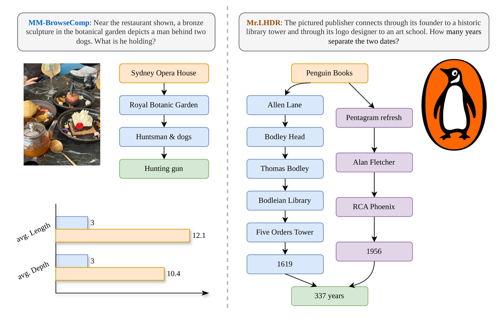
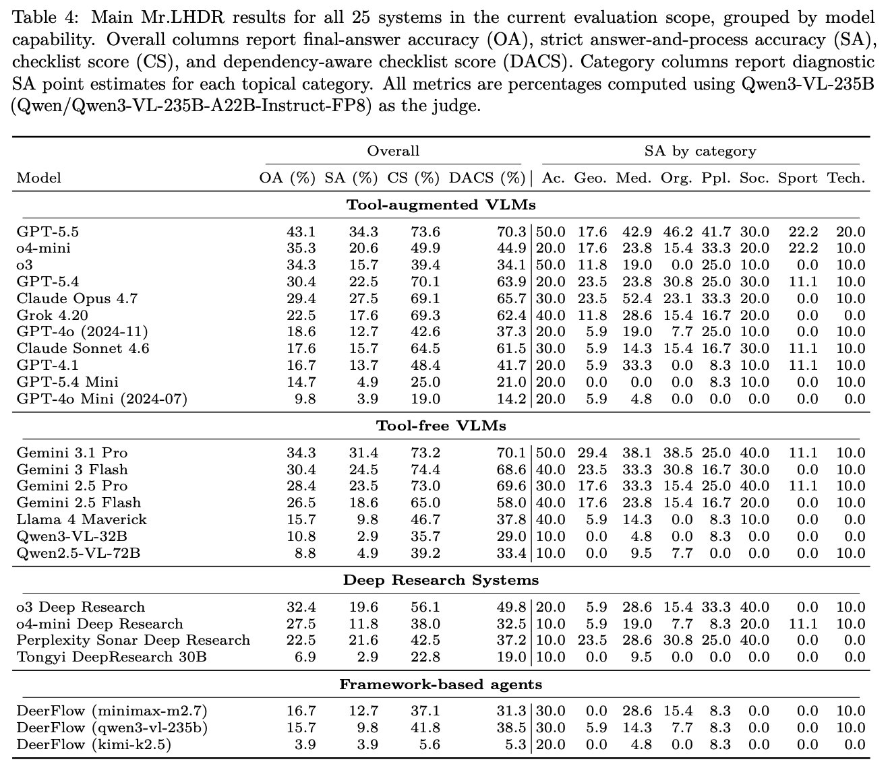
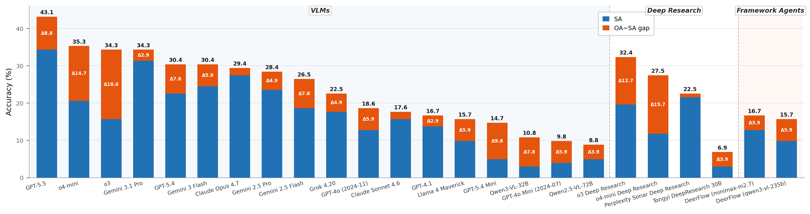

<div align="center">
<h1>Mr.LHDR: A Benchmark for Multimodal Real-World Long-Horizon Deep Research Agents</h1>
</div>
<div align="center">

[](https://arxiv.org/abs/2609.11318)
[](https://github.com/minghaoguo20/Mr-LHDR)
[](https://huggingface.co/datasets/Henryeahhh/Mr-LHDR)
[](https://opensource.org/licenses/Apache-2.0)

</div>

## 🎩 Overview



**Mr.LHDR** (Multimodal real-world Long-Horizon Deep Research) is a benchmark of
102 real-world research questions across eight categories. Each item pairs a
question and a short verifiable answer with an irreducible checklist of
necessary intermediate conclusions and a verified dependency graph between
them, so credit reflects partial, dependency-consistent progress rather than
just the final answer. Where the public MM-BrowseComp image-input release
averages 3.0 checklist items per question, Mr.LHDR averages 12.1 conclusions per item across a dependency depth
of 10.4, often spanning parallel branches.

Four metrics, computed per item then averaged:

| Metric | Full name | What it measures |
|:---:|---|---|
| **OA** | Overall Accuracy | Did the final answer match the reference? |
| **SA** | Strict Accuracy | OA **and** every checklist step satisfied |
| **CS** | Checklist Score | Fraction of steps satisfied, in any order |
| **DACS** | Dependency-Aware Checklist Score | A step counts only once every prerequisite in its dependency graph is also satisfied, so `DACS ≤ CS` always |

## 🏁 Main Results

25 systems, grouped by model capability. `OA`/`SA`/`CS`/`DACS` are the
metrics above; category columns are diagnostic SA point estimates per topic.
Judged by Qwen3-VL-235B (`Qwen/Qwen3-VL-235B-A22B-Instruct-FP8`).





---

## 🚀 Quick Start

```bash
git clone https://github.com/minghaoguo20/Mr-LHDR.git && cd Mr-LHDR
pip install -r requirements.txt
```

### 1. Get the data

```bash
pip install -U huggingface_hub
hf download Henryeahhh/Mr-LHDR --repo-type dataset --local-dir ./data
```

<!-- Or skip the download and let `run` do it —
`scripts/run.py --hf-repo Henryeahhh/Mr-LHDR ...` (needs
`pip install huggingface_hub`; `pip install "benchmark-eval[hf]"` instead if
you installed the package). `judge`/`score` still take a plain
`--items <path>`; reuse the path `run` printed. -->

### 2. Decrypt

```bash
python scripts/decrypt.py \
    --items data/metadata.jsonl \
    --out data/metadata.decrypted.jsonl
```

### 3. Run — answer every item

```bash
python scripts/run.py \
    --items data/metadata.jsonl \
    --model openai/gpt-5.5 \
    --openrouter --web-search \
    --out runs/gpt55.jsonl
```

`--openrouter` is a shortcut; otherwise point `--base-url` / `EVAL_BASE_URL` at any OpenAI-compatible endpoint (vLLM, SGLang, Ollama, a vendor). `--resume` picks up where an interrupted run stopped.

### 4. Judge — score the answers with an LLM judge

```bash
export EVAL_JUDGE_BASE_URL=https://dashscope.aliyuncs.com/compatible-mode/v1
export EVAL_JUDGE_MODEL=qwen3.5-flash-2026-02-23
export EVAL_JUDGE_API_KEY=...
python scripts/judge.py \
    --items data/metadata.jsonl \
    --responses runs/gpt55.jsonl \
    --out runs/gpt55.verdicts.jsonl
```

### 5. Score — aggregate the metrics

```bash
python scripts/score.py \
    --items data/metadata.jsonl \
    --verdicts runs/gpt55.verdicts.jsonl \
    --responses runs/gpt55.jsonl
```

<!-- `--responses` lets a failed run score zero instead of being skipped. -->

<!-- Run, judge and score are separate commands because model runs are the expensive part: answer once, then re-judge or re-score the stored responses as many times as you like. The paper's 12-judge agreement study was produced this way, from a single frozen set of responses. -->

---

## 📄 Citation

```bibtex
@misc{guo2026mrlhdrbenchmarkmultimodalrealworld,
      title={Mr.LHDR: A Benchmark for Multimodal Real-World Long-Horizon Deep Research Agents}, 
      author={Minghao Guo and Meng Cao and Sui Zhao and Siyu Ning and Xin Wang and Haoze Zhao and Jiaxuan Yang and Haihong Hao and Mingfei Han and Shunlin Rong and Haijun Wu and Xiaodan Liang and Xiaojun Chang},
      year={2026},
      eprint={2609.11318},
      archivePrefix={arXiv},
      primaryClass={cs.AI},
      url={https://arxiv.org/abs/2609.11318}, 
}
```
